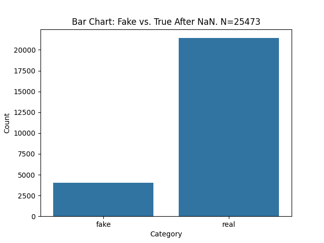
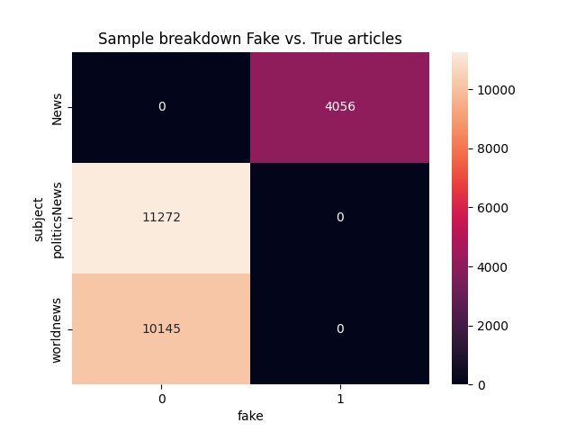
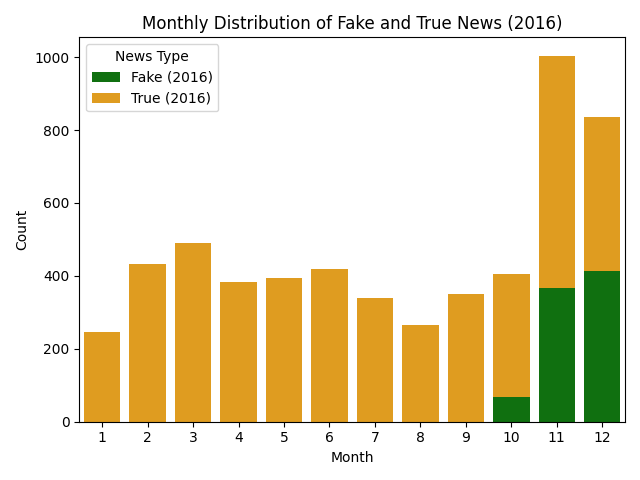
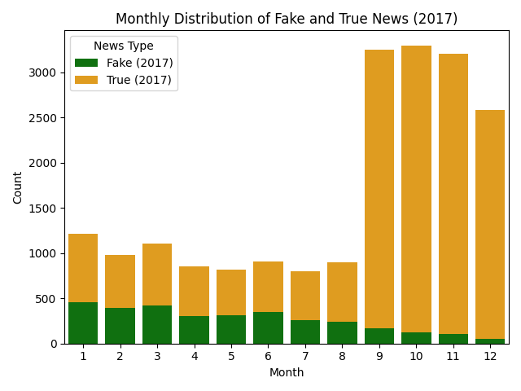
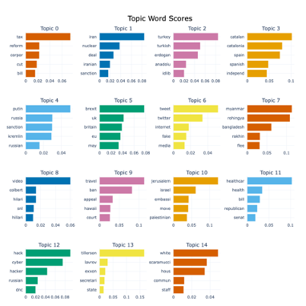
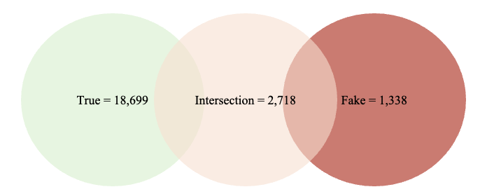
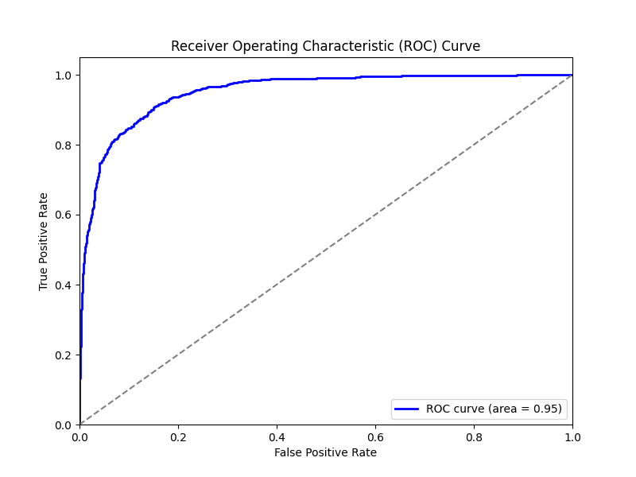
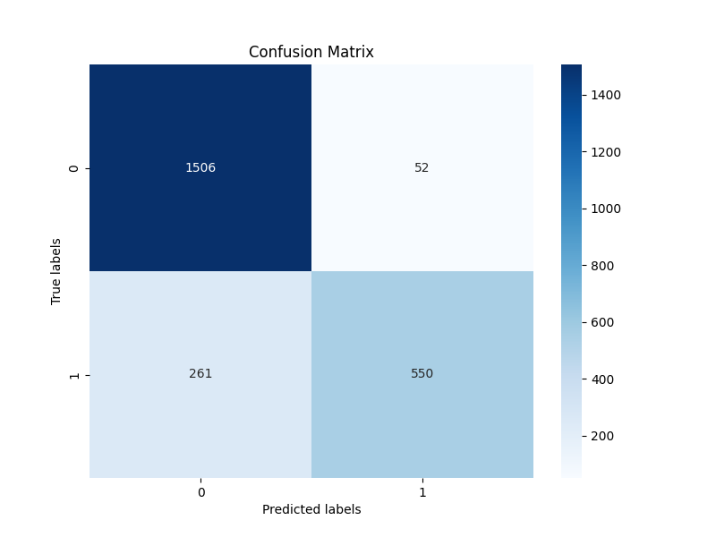
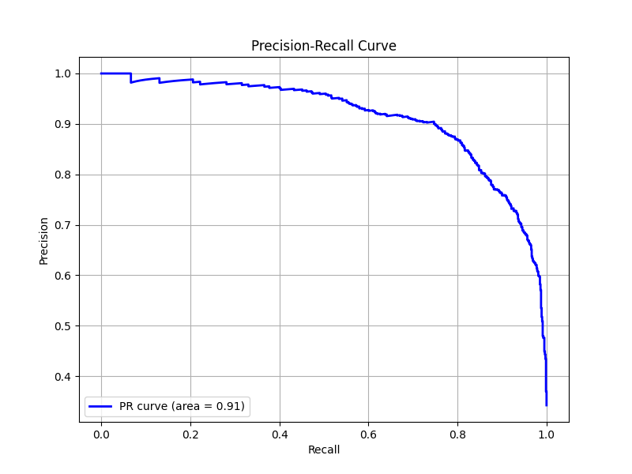

# Fake News Detection using ML

### Background

In this project, I have been tasked with building a classification algorithm to differentiate between real and fake news articles. This solution was developed in one day. Further steps are discussed in the next steps section.

### Project Setup

Data can be downloaded [using this link](https://1drv.ms/f/s!Aht2ewWAV68Z6jVQ4fEESXaI6C8-?e=B2Zicz). Place True.csv and Fake.csv in the /data/raw folder.

### Using this repository
Preface: If I had more time, I would dockerise this solution. 

The user can setup their environment by calling “python3 setup.py”. This will create a virtual environment named “fake_news”.

Please activate this environment by calling “source fake_news/bin/activate”.

Then change directory (cd) into “src” and run the following:
- “python3 src/explore_dataset.py”: Run EDA analysis.
- “python3 src/build_eval_clf.py”: Retrain a classification algorithm.
- “python3 app/inference.py”: Run inference mode!

### Project discussion

In this report, I will discuss my solution in the following two steps:

- Exploratory Data Analysis (EDA): What are the characteristics of my dataset, what can I expect when building a machine learning pipeline?
- Machine Learning Pipeline: A discussion of implementation of the machine learning pipeline from data pre-processing, model building and evaluation.

#### EDA analysis

The first step is to understand the features associated with both Fake.csv and True.csv.

| Feature  | Description                                      |
|----------|--------------------------------------------------|
| Title    | Title of the news article.                       |
| Text     | Text within each article.                        |
| Subject  | The subject which consists of political, world, and general news. |
| Date     | Date of the published article.                   |

During pre-processing, it was noted that there are entries with NaN, these have been excluded from the dataset with the following statistics updated to include the removal of the NaN entries.

 

Figure 1: Data distributions between fake and real articles after removing NaN entries

There is a huge imbalance within the dataset which must be accounted for during pre-processing/model building. A further step is to understand the sample sizes of both fake and real articles within the subject category, this is presented below.

 

Figure 2: Data distributions between fake and real articles within each subject. 

Figure 2 highlights there aren’t any true articles for the category ‘News’. This may potentially cause challenges with generalisability as the data distribution of ‘worldnews’ and ‘politicsnews’ may be different from ‘News’. An example could be that ‘News’ articles may indeed be news about aliens for all we know 👽.

The next step looks at understanding the date distributions of articles. If fake articles are published decades apart from true articles the underlying grammar / vocabulary may have changed, and such the model may simply learn to differentiate between vocabulary rather than any salient features associated with fake news. Another challenge is also called concept drift, for example something that was fake news decades ago, may not be now and vice versa.

 

Figure 3 highlights that data falls between 2016-17 with fake news articles starting in October 2016 and slowly decreasing in 2017. Therefore, I do not expect any type of data or concept drift. However, further analysis is conducted in next steps.

Finally, the next step is to understand the topic breakdown of the dataset. To achieve this, I used BERTopic, a pretrained BERT transformer and c-TF-IDF (Contextual Term Frequency-Inverse Document Frequency) to extract topics. 

Figure 4: Themes within the dataset

As seen from figure 4, there are multiple themes within the dataset such as Brexit, Iran, Tax, Turkey, Spain and so on. The most interesting insight will come from understanding the topic distributions between Fake and True news articles. 

Figure 5: Intersection of topics between True and Fake articles

As seen from figure 5, there is a huge intersection between True and Fake articles. This may pose a challenge if the underlying data distribution/topics are the same. However, we would hope that the type of language / sentence structure used for fake articles within the same topic is different and that more sophisticated algorithms can generate sentence representations which allow for such differentiation. 

I decided to stop here. The following is what I’ve learnt from the EDA:

- There is a huge data imbalance between Fake and True articles.
- All fake examples seem to be within the category ‘news’.
- Most of the fake tweets are limited to October 2016-Jan2017.
- The data covers a broad number of topics from Iran, Tax, China etc.
- There is a huge intersection between fake and true news articles.

#### ML Pipeline

The machine learning pipeline covers the entire system from data representation to model building, optimisation, and evaluation/inference. 

##### Data Representation

The standard data cleaning processes were applied such as lowering, removal of special characters, tokenization, and removal of stop words. These functions can be seen in utils.py. I opted to implement multiprocessing to speed up this section.

As seen from the EDA, a strong class imbalance exists. There are numerous ways to address this:

- Apply up sampling i.e. SMOTE, and up-sample the underrepresented class. I find SMOTE to be good in extremely low data scenarios, however, for much larger sets not very useful. Ultimately, we are bounded by the data distribution of the underrepresented class.
- Down sample the majority class. 
- Penalise the model during training by using a cost which considers the underrepresented class i.e. F1. 
- Get more data. This is always the preferred option. I found an additional dataset on Kaggle (link to dataset).  

My approach in this study will be to downsample due to time constraints. I would prefer to get more data.

I will opt to leverage pretrained LLMs. I will generate sentence embeddings using the HuggingFace sentence transformers library. For the embedded representations I will be using multi-qa-MiniLM-L6-cos-v1.

##### Model Construction

For demonstration purposes, I have opted to code up a simple linear neural network using PyTorch. I experimented with various hyperparameters. In practice, I would prefer to use Optuna for hyperparameter tuning. I prefer this over an exhaustive grid search as it finds hyperparameters which best optimise test accuracy rather than exhaustively trying various combinations. 

##### Model Evaluation

Preface: I would usually go to further extremes to investigate model performance. I.e. performance within subsets, nested CV, CIs on performance metrics. But due to time constraints I did not.

Figure 6: Confusion matrices

Figure 7: PR curves

Figure 8: ROC curve

The performance metrics were:
- Accuracy: 89%
- Precision: 89%
- Recall/Sensitivity: 77%
- F1: 82%

### Next steps

If I had more time, I would:

- Solution standards:
  - Implement unit/integration and smoke tests to increase code reliability and ensure the reduction of any potential bugs slipping through to production. 
  - Add multiprocessing when generating sentence embeddings.
  - Implement logging (I didn’t get round to it).
  - Refactor the code.
  - Dockerising my code for packaging, distributing, and running this code.
- Dataset:
  - I would spend more time understanding my data, and thinking about how I can improve it. I tend to take data-centric approach over model-centric. During the EDA process, could I spot anything else that might be useful when developing the ML pipeline?
  - I would experiment more with various sentence embeddings.
  - I would gather data from external sources.
- Model:
  - I would use an LLM for end-to-end classification using the HuggingFace API. I opted to develop a simple NN for demonstration purposes.
    - I would implement Optuna for hyperparameter selection.
- Evaluation:
  - Implement nested cross validation to generate confidence estimates around model stability.
- Deployment:
  - What type of deployment strategy would we adopt?
  - Can we afford to deploy large models, are we constrained?
  - How would we monitor model drift, i.e. concept/data drift.

